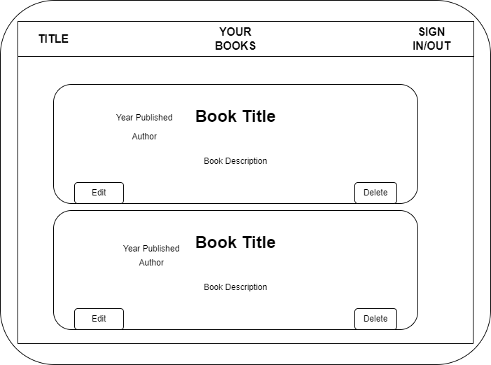
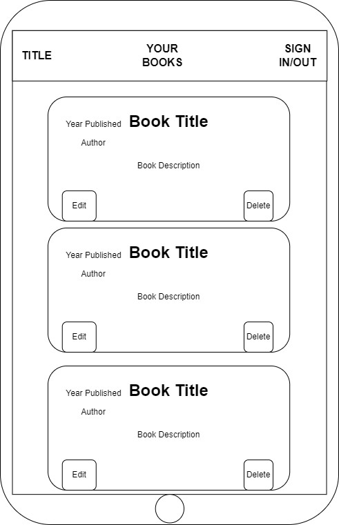
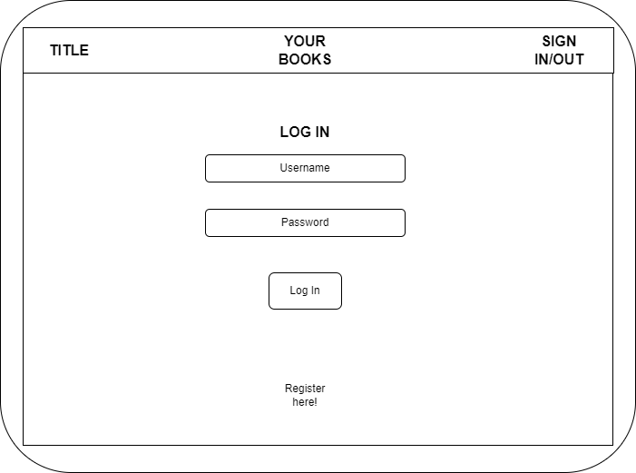
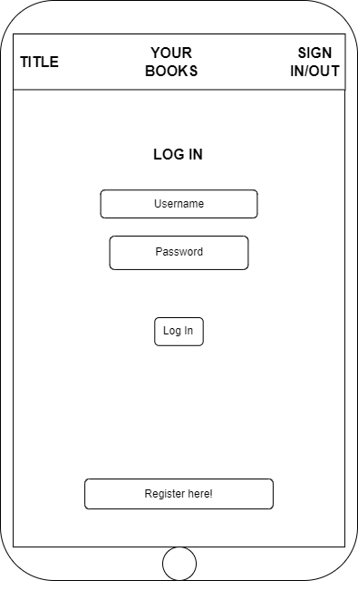
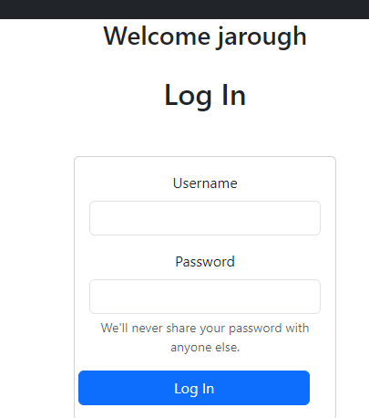
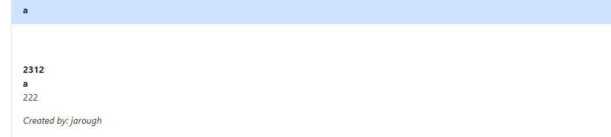
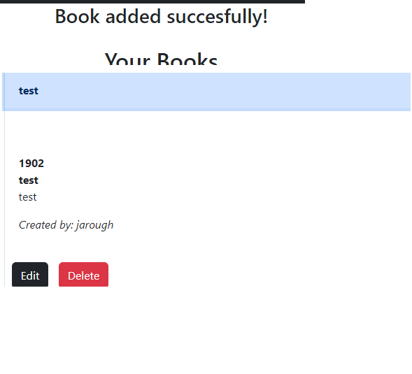
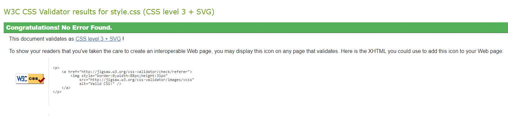
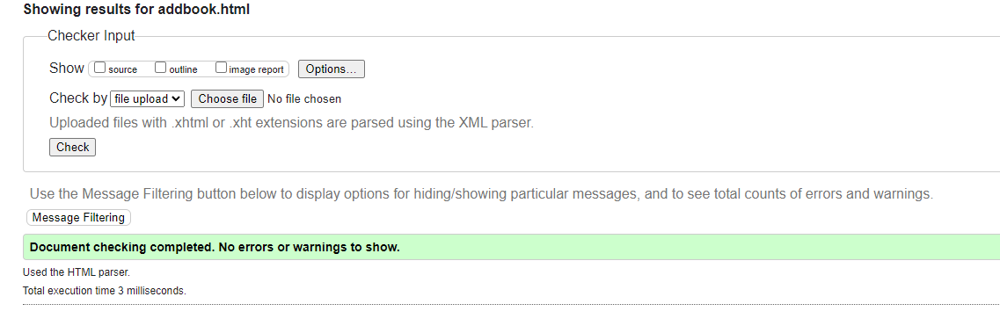
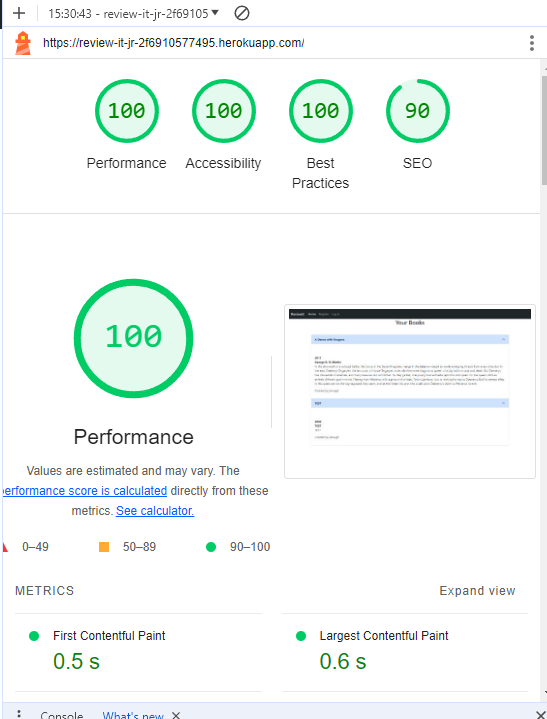

# ReviewIt

## Table of Contents

### UX Design
* Project Goals
* Design Choices
* User Stories
* Wireframes

### Features
* Existing Features
* Features to be implemented
### Technologies Used
### Testing
### Deployment
### Credits
* Content
* Media
* Code
* Acknowledgements

## UX Design

### Project Goals
My goal from creating this project was to make a very simple site that can store the essential details about the books any given user has read, allowing them to review and keep track of what they have read in one place.

The external user goals are to be able to:
* Register an account with the site.
* The ability to log in and out at any time.
* Add, edit or delete any books they have read into their 'My Books' section on the home page, containing details such as release year, author and a brief summary of each one.

The site owner goals are to:
* Build a plentiful database of different books across a wide range of users.
* Keep users of the site interested by displaying books read by different users on the home page, potentially allowing them to explore a new book.

### User Stories

### Design Choices

#### Font
* I have utilised Bootstrap's default font throughout the headers and paragraphs on the site because it is very easy to read on all devices and isn't obscured when the text is made larger.

#### Colours
* I have used monochromatic colours on the site, as I feel that vibrant background and text colouring would be quite offputting for long-time viewing, or against the lengthy summaries that some books may have.

#### Styling
* The home page features an accordion with all of the currently added books. These can be collapsed or extended all at once which keeps the bulk of the information hidden.

### Wireframes

* Home Page (Desktop)

* Home Page (Mobile)

* Log In/Register Screen (Desktop)

* Log In/Register Screen (Mobile)

## Features

### Existing Features
* MongoDB Collection containing all user details and books
* Register Account System
* Bootstrap Components
* Validation checks on input boxes
* Log In/Out System
* Ability to add, edit or delete your entries when logged into the site

### Features to be implemented
* Adding images for every inputted book, would be very helpful to see but could pose size or resolution problems with the site across different devices.
* Adding a search feature on the home page, would be useful for users who are eager to find a specific book or for those with a very high amount of books.

## Technologies Used
* HTML
* CSS
* JavaScript
* Bootstrap 5.3
* Python+Flask
* MongoDB

## Testing

### Manual Testing
* User expects the site to show a flash of 'welcome' after inputting the correct login details.
    * 
    * The result was as expected and the user was successfully logged in.

* User expects to see no edit or delete button on a book entry that was not theirs.
    * 
    * The result was as expected. As the 'Created by:' name referred to a different account, the options were not present for the current user.

* User expects to see a successful pop up after adding a book on the add page and their corresponding name next to the 'Created by:' text.
    * 
    * The result was as expected with the correct flash message playing on the add book page, as well as correctly assigning it with the current active user in the database.

### Site Checks
#### W3C CSS Validation

    

    
#### W3C HTML Validation

#### Google Dev Tools Lighthouse

    
### Bugs
* Very early into development the Procfile was not being picked up when trying to initialise the app on Heroku. To fix, the file type encoding has been changed from UTF-16 to UTF-8 and is now functioning correctly.

## Deployment
* This project was developed using Visual Studio Code IDE with commits to git and pushed to GitHub using Source Control.
* Live Website deployed on [Heroku](https://review-it-jr-2f6910577495.herokuapp.com/)
* Repository stored on [GitHub](https://github.com/jarough/reviewit)

## Credits

### Content & Media
* To gain knowledge about the testing books
    * [Recaptains - A Dance With Dragons Summary](https://recaptains.co.uk/2018/01/a-dance-with-dragons-by-george-r-r-martin/)
  
### Code
* Tasks Mini-Project
* [Bootstrap Navbar Documentation](https://getbootstrap.com/docs/5.3/components/navbar/)
* [Bootstrap Cards Documentation](https://getbootstrap.com/docs/5.3/components/card/)
* [Bootstrap Accordion Documentation](https://getbootstrap.com/docs/5.3/components/accordion/)
* [StackOverflow post which helped with initial database connection issues](https://stackoverflow.com/questions/75791588/attributeerror-nonetype-object-has-no-attribute-users)
